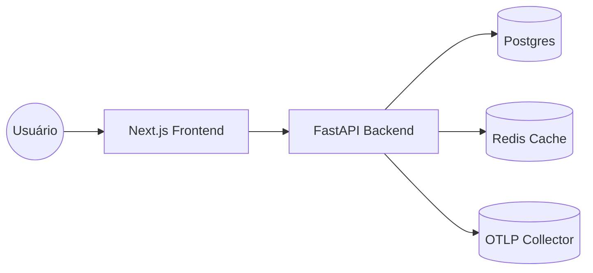
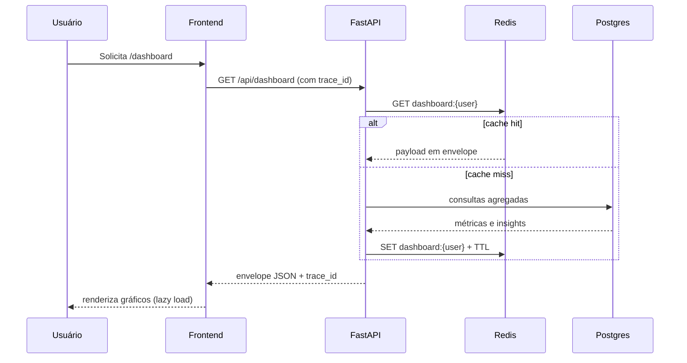

# Diagramas (C4 simplificado)

## Contexto


## Contêineres
```mermaid
graph TD
  subgraph Web
    FE[Next.js (SSR/CSR)]
  end
  subgraph API
    BE[FastAPI + Orquestrador]
    Worker[Cache/Repos]
  end
  subgraph Data
    PG[(Postgres)]
    RDS[(Redis)]
  end
  FE -->|HTTPS| BE
  BE -->|SQLAlchemy/Alembic| PG
  BE -->|aioredis| RDS
  BE -->|OTLP| OTEL[Collector]
```

## Fluxo crítico (dashboard)

